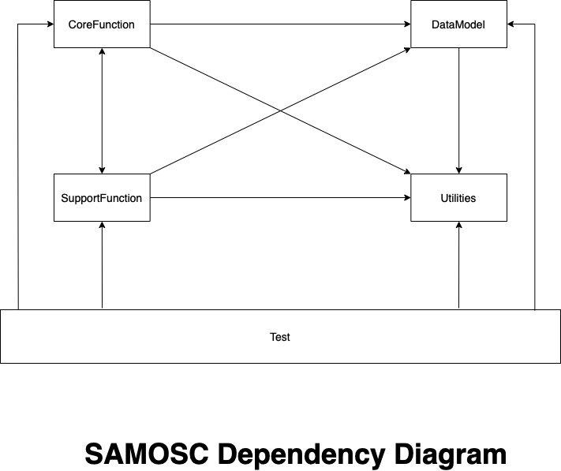

# Samos

| Purpose <string> | Amount <#> |    Tx Type <+,-> <1, 0> |    Date & Time <date>    | Cummulative Amount <#> |
|------------------|------------|----------------------|----------------------|------------------------|
| tea shop | 20 |    0 |    22-04-2023:8:08:3346    | -20 |
| april salary | 10000 |    1 |    22-04-2023:10:08:3346    | 9980 |

### Dependency Diagram of Modules

